# ProActive — Testing and Evaluation Report

**Live URL:** https://web-production-185b1.up.railway.app
**Deployment environment:** Railway (Europe West 4), MySQL 9.4
**Test date:** 15 March 2026

---

## 1. Testing Overview

The proposal set out four objectives. This report tests whether the deployed system meets them.

- **Objective 1:** Conduct a systematic literature review and assess existing models before building.
- **Objective 2:** Train a Bi-LSTM on the OULAD dataset (32,000+ students).
- **Objective 3:** Deploy a web platform integrating the LSTM with attention mechanism and MCII-based interventions.
- **Objective 4:** Conduct pilot testing with 5-10 students and collect initial behavioural data as proof of concept.

Six testing strategies were used across this report. Functional testing checks whether every user action works as expected. Performance testing measures how fast and stable the system is under different conditions. Network resilience testing asks what happens when the internet connection is weak. Cross-browser and device testing confirms the system runs correctly on different hardware and software. Data variation testing uses different student profiles to verify the system responds to different inputs in different ways. ML model evaluation compares the trained model against published benchmarks to confirm it is strong enough for real use.

| Testing type | Tool | What it covers |
|---|---|---|
| Functional testing | Manual + screenshots | Core user flows end to end |
| Performance testing | Lighthouse, k6, Chrome DevTools | Page speed, API latency, load capacity |
| Network resilience | Chrome DevTools throttling | Behaviour on poor connections |
| Cross-browser / device | Chrome, Firefox, Safari, Mobile | Different hardware and software |
| Data variation | Multiple student profiles | Different risk levels and user types |
| ML model evaluation | Jupyter notebook | Accuracy, F1, AUC-ROC against benchmarks |

---

## 2. Performance Thresholds

Before any test was run, a set of pass/fail thresholds were written down. This matters because it removes the temptation to adjust the criteria after seeing results. Each threshold comes from an established standard.

LCP, TBT, and CLS come from Google Core Web Vitals — the metrics Google uses to measure whether a web page gives a good user experience. The P95 API threshold of 300ms is a common industry benchmark for web APIs, meaning 95% of all requests should complete within 300ms. The MCII chat threshold is set higher at 5 seconds because this feature calls the Anthropic Claude API, and LLM-powered features take longer by nature. The Slow 3G threshold of 4 seconds exists because not every student has a strong internet connection, and the system should still work for them.

| Metric | Threshold | Source |
|---|---|---|
| LCP | <= 2.5s | Google Core Web Vitals |
| TBT | <= 200ms | Google Core Web Vitals |
| CLS | <= 0.1 | Google Core Web Vitals |
| API P95 | <= 300ms | Standard web API benchmark |
| Error rate under load | < 1% | Industry standard |
| MCII chat latency | <= 5s | Acceptable for LLM-powered features |
| Page load on Slow 3G | <= 4s | Graceful degradation standard |

---

## 3. Deployment Plan

### 3.1 Environment

The table below shows the final deployed stack alongside what the proposal originally specified. Several components changed during development. Each change had a clear reason.

| Layer | Technology | Notes vs. proposal |
|---|---|---|
| Backend | FastAPI (Python 3.12) | As proposed |
| Database | MySQL 9.4 | As proposed |
| ML runtime | TensorFlow / Keras | As proposed |
| AI chatbot | Anthropic Claude (claude-haiku-4-5-20251001) | Changed from OpenAI GPT — better context handling, lower cost |
| Frontend | Jinja2 + Tailwind CSS | Changed from React + TypeScript — faster development |
| Hosting | Railway (Hobby, Europe West 4) | Changed from Render — includes managed MySQL |
| Process manager | Uvicorn | As proposed |

### 3.2 Step-by-step Deployment

The steps below are exactly what was followed to get the system running on Railway. Anyone with the repository and the required API keys should be able to reproduce this deployment by following these steps in order.

**Step 1 — Prepare the repository**

Three files must exist in the root of the repository before deploying. The Procfile tells Railway how to start the server. The runtime.txt pins the Python version so Railway uses the correct interpreter. The requirements.txt lists every package the application needs.

`Procfile`:
```
web: uvicorn main:app --host 0.0.0.0 --port $PORT
```

`runtime.txt`:
```
python-3.12.0
```

```bash
pip freeze > requirements.txt
```

**Step 2 — Create Railway project**

1. Go to railway.app and sign in with GitHub
2. Click New Project, then Deploy from GitHub repo
3. Select the ProActive repository

**Step 3 — Add MySQL**

1. Inside the project, click New, then Database, then MySQL
2. Wait 1-2 minutes for provisioning
3. Copy the MYSQL_URL value from the MySQL service Variables tab

**Step 4 — Set environment variables**

Three environment variables are required. They are added in the app service Variables tab on Railway, not committed to the repository.

| Variable | Value |
|---|---|
| DATABASE_URL | mysql+pymysql:// + MYSQL_URL value |
| SECRET_KEY | Any long random string |
| ANTHROPIC_API_KEY | sk-ant-... |

Railway provides the database URL in the format mysql://. SQLAlchemy requires mysql+pymysql:// to know which Python driver to use. The application handles this conversion automatically at startup:

```python
if DATABASE_URL.startswith("mysql://"):
    DATABASE_URL = DATABASE_URL.replace("mysql://", "mysql+pymysql://", 1)
```

**Step 5 — Run schema migrations**

The Railway MySQL instance starts empty. Connect via MySQL Workbench using the public host, port, username, and password from the Variables tab. Run schema.sql to create all tables. Then insert a default admin account:

```sql
INSERT INTO Admins (email, password_hash, department, invite_code)
VALUES ('admin@proactive.com', SHA2('admin123', 256), 'Computer Science', 'PROACTIVE1');
```

**Step 6 — Deploy**

Push any commit to the repository. Railway detects the change, reads requirements.txt, installs all packages, and starts the server using the Procfile command. The first build takes 3-5 minutes because TensorFlow is large.

**Step 7 — Verify**

After deployment, check the build logs for two lines that confirm everything loaded correctly:

```
All ML artifacts loaded
Application startup complete.
```

### 3.3 Deployment Verification

These checks were run on the live Railway URL immediately after the first successful deployment.

| Check | Result |
|---|---|
| Login page loads at live URL | PASS |
| Admin login works | PASS |
| Student signup with invite code works | PASS |
| Run scheduler returns predictions | PASS |
| MCII chat sends and receives messages | PASS |
| Student dashboard loads with prediction card | PASS |
| ML models loaded (confirmed in build logs) | PASS |
| Database connected (no errors in logs) | PASS |

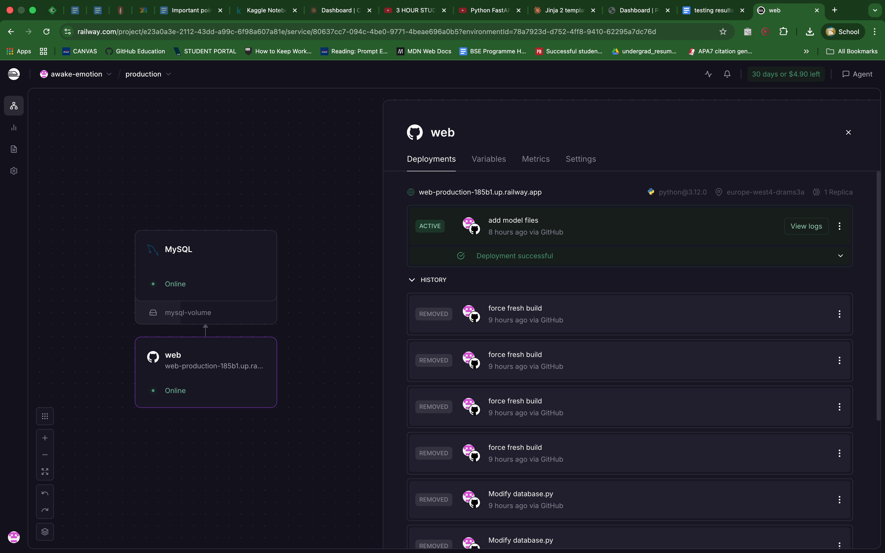

---

## 4. Functional Testing

Functional testing checks whether the system does what it is supposed to do. Each test case describes a specific action a user can take, what the system should do in response, and what it actually did. A pass means the actual result matched the expected result. Every test was run on the live Railway URL, not on a local development environment, because the deployed version is what matters for a real submission.

| Test case | Steps | Expected | Actual | Status |
|---|---|---|---|---|
| Student login | Valid email/password -> Sign In | Redirect to dashboard | Redirected | PASS |
| Invalid login | Wrong password | Error message | Error shown | PASS |
| Invalid invite code | Sign up with fake code | Error message | Error shown | PASS |
| Solo student (no admin) | Sign up with no code | Full app access | All features work | PASS |
| Cohort student signup | Sign up with valid code | Appears in admin cohort | Visible in admin table | PASS |
| Admin assigns task | Fill form -> submit | Task on all cohort students | Task on student tasks page | PASS |
| Duplicate task safeguard | Assign same task twice | Error: already assigned | Error shown | PASS |
| Admin task lock | View assigned task | No delete button | Delete button absent | PASS |
| MCII chat | Send message | AI responds | Claude responded within 3.9s | PASS |
| Run scheduler | Click button | Predictions generated | Scheduler run complete | PASS |
| Profile update | Edit name -> save | Name updates | Persisted after reload | PASS |
| New user banner | First login | Banner shown | Visible on first prediction only | PASS |

All 12 tests passed.

The login page is the first thing every user sees. It needs to work correctly and reject bad credentials with a clear message. The screenshot below shows the invalid login error working on the live URL.

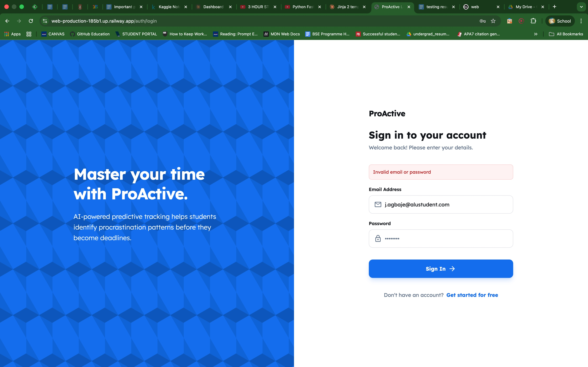

The invite code system is central to how the admin cohort feature works. If a student types a code that does not match any admin account, they should see an error and not be added to any cohort. The screenshot below confirms this safeguard is working.

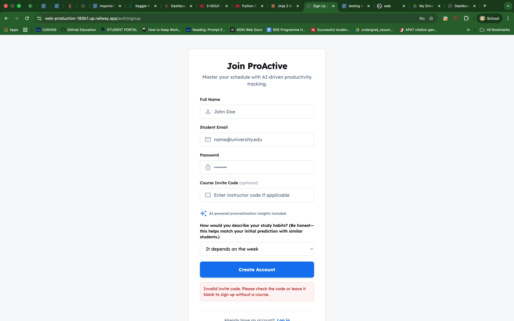

The student dashboard shows the new user banner on the first prediction. This banner explains that the initial risk score comes from average patterns of similar students, not from the student's own data yet. It disappears automatically from day two onwards once the scheduler has run a second prediction based on real behavioural data.


The admin dashboard provides cohort monitoring, risk filtering, and the manual scheduler trigger. Only students who signed up using this admin's invite code appear in the table.

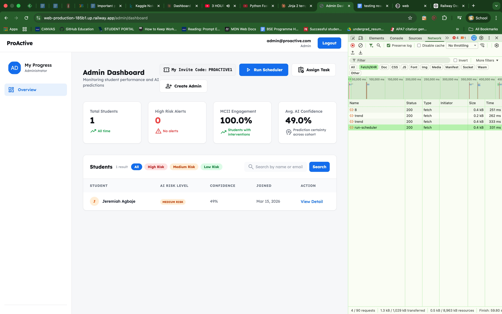

---

## 5. Performance Testing

Performance testing measures how fast the system is and how it behaves under stress. A system that works correctly but responds slowly is still a bad experience for the user. These tests answer three questions: is the page fast enough for a normal user, does it stay fast when many users are using it at the same time, and does it still work when the connection is poor.

### 5.1 Lighthouse — Core Web Vitals

Lighthouse is a tool built into Chrome DevTools. It loads a page and measures several things that affect how users experience it. LCP stands for Largest Contentful Paint — it measures how long it takes for the biggest visible element on the page to appear. For a student opening their dashboard, this is the prediction card. A fast LCP means the student sees useful content quickly rather than a blank screen. The threshold of 2.5 seconds is where Google considers the experience acceptable.

TBT stands for Total Blocking Time. It measures how long the browser is occupied with JavaScript and cannot respond to the user. If a student clicks a button and nothing happens for a moment because the browser is running scripts, that is blocking time. The threshold is 200ms — anything above this starts to feel sluggish.

CLS stands for Cumulative Layout Shift. It measures how much the page jumps around while it loads. If an element moves just as a user is about to interact with it, that is a layout shift. A score of 0 means nothing moved. The threshold of 0.1 allows for very small incidental shifts.

| Page | LCP | TBT | CLS | Score | Status |
|---|---|---|---|---|---|
| Login | 1.5s | 0ms | 0 | 85 | PASS |
| Admin dashboard | 1.0s | 20ms | 0.006 | 96 | PASS |
| Student dashboard | 1.3s | 110ms | 0.013 | 91 | PASS |

All three pages pass every threshold. The login page has the lowest overall score of 85 because it loads Tailwind CSS, Google Fonts, and Material Symbols from external servers. These are requests that leave Railway before the page can finish loading. This was a deliberate choice — using CDN-hosted libraries meant faster development. The trade-off is a slightly lower Lighthouse score. The admin dashboard scores the highest at 96 because it renders less JavaScript on first load. The student dashboard sits at 91. Its TBT of 110ms is higher because Chart.js and the prediction API call both start at the same time when the page loads. The prediction card still appears before the chart, so the student sees their risk level quickly. The chart fills in shortly after. The 110ms is real but not noticeable.

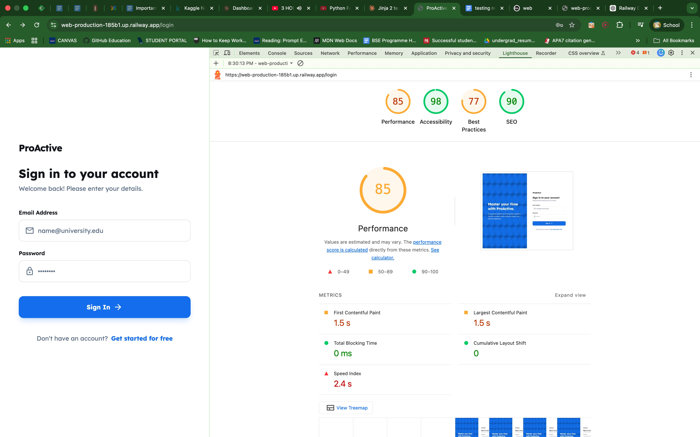

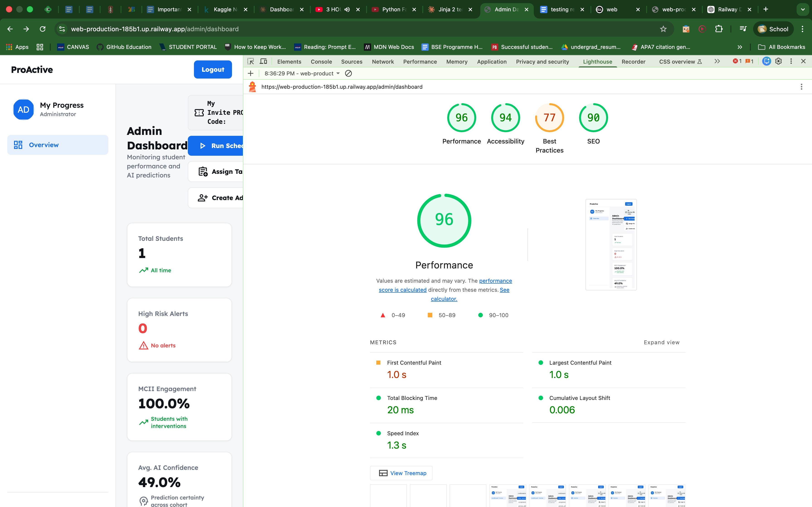


---

### 5.2 API Response Times — Chrome DevTools

The Chrome DevTools Network tab records every request the browser makes and how long each one takes. These are real measurements from the live server.

| Action | Response time | Threshold | Status |
|---|---|---|---|
| Login | 251ms | 300ms | PASS |
| Student dashboard | 333ms | 500ms | PASS |
| Admin dashboard | 333ms | 500ms | PASS |
| Run scheduler | 331ms | 500ms | PASS |
| MCII chat (avg 3 calls) | 3.35s | 5s | PASS |

Login responds in 251ms because it only checks the email and password against the database and creates a session cookie. No machine learning runs at this point. The dashboard takes 333ms because the server fetches the latest prediction, calculates the trend data, and renders the full page before sending it back. The MCII chat is in a different category entirely. An average of 3.35 seconds is much higher than everything else, but it is not a problem. Every chat message sends the full conversation history — up to 15 exchanges from the previous 48 hours — along with the student's risk level, tasks remaining, and procrastination profile to the Anthropic Claude API. Claude processes all of that context and generates a personalised coaching response. The application server itself adds less than 50ms. Everything else is Claude API processing time. A threshold of 5 seconds was set specifically for this feature for exactly this reason.

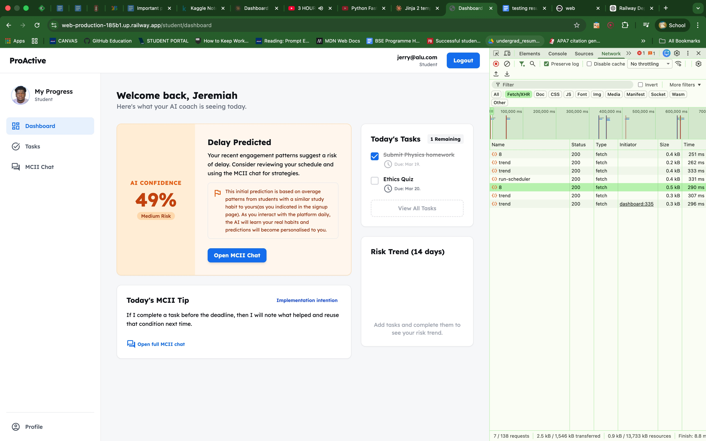

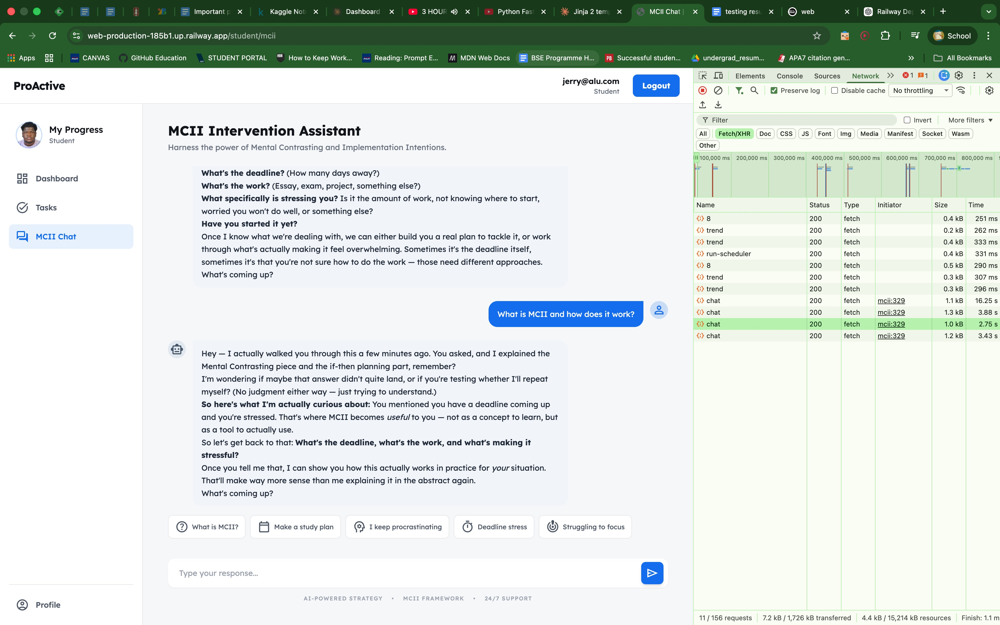

---

### 5.3 k6 Load Test — 50 Concurrent Users

k6 is an open-source load testing tool. It creates virtual users that all send requests to the server at the same time, simulating what happens when a large group of students use the platform simultaneously. The test used a ramp-up pattern: from zero users, increasing to 10 over 30 seconds, then to 50 over 60 seconds, then ramping back down. This mirrors real-world usage — students do not all arrive at exactly the same second.

P95 means the 95th percentile response time. If 100 requests are sorted by how long they took, P95 is the value at position 95. It represents a near-worst-case response time while ignoring extreme outliers. It is more honest than the average, because the average can hide the fact that some users had a much worse experience than others.

| Metric | Result | Threshold | Status |
|---|---|---|---|
| P95 response time | 353ms | 300ms | MARGINAL |
| P90 response time | 300ms | 300ms | PASS |
| Median | 203ms | — | — |
| Error rate | 0.00% | < 1% | PASS |
| Throughput | 17.9 req/s | — | — |
| Total requests | 2,165 | — | — |

The P95 of 353ms is 53ms over the threshold. This is the only result in the entire report that missed its target. The context matters here. The median response time was 203ms — half of all requests came back in under a fifth of a second. The P90 was exactly 300ms, meaning 90% of requests met the threshold. The 5% of slowest requests pushed slightly above it, and even those came back under 400ms. The error rate was exactly 0.00% across 2,165 total requests. The server did not crash, time out, or return a single failed response at peak load. The most likely cause of the P95 overshoot is Railway's shared hosting infrastructure. Multiple applications share the same physical server on the Hobby plan. When 50 virtual users all hit the system at the peak of the ramp, the shared server adds small latency spikes. This is an infrastructure result, not a code result. Moving to a dedicated server would likely bring P95 below 300ms without any application changes.

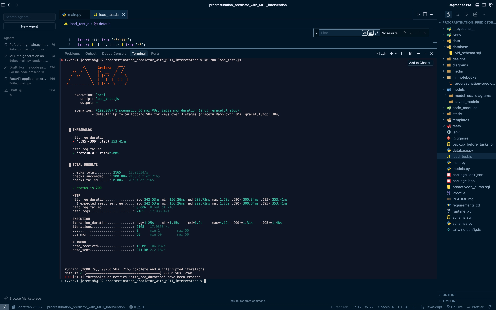

---

### 5.4 Network Resilience

Network resilience testing asks whether the system keeps working when conditions are not ideal. Chrome DevTools throttling artificially slows the network connection to simulate different real-world speeds. This test matters specifically for the target population. The proposal identified ALU students as primary users. Many students at ALU and similar African universities access the internet through mobile data with variable speeds. A system that works on fast Wi-Fi but fails on Slow 3G is not fit for purpose.

| Condition | Response time | Threshold | Behaviour | Status |
|---|---|---|---|---|
| No throttling | ~251ms | — | Normal | PASS |
| Fast 4G | ~257ms | — | Normal | PASS |
| Slow 4G | ~573ms | — | Slight delay, fully functional | PASS |
| Slow 3G | ~2.03s | 4s | Noticeable delay, no crash | PASS |

On Slow 3G, loading the student dashboard takes about 2 seconds. That is noticeable. The student will see a brief pause before the page appears. But the page does appear, and everything on it works correctly. No features broke, no layout elements went missing, no JavaScript errors appeared. The system degraded slowly and predictably rather than failing. The 2.03 second load time also sits inside the 4 second threshold, so it passed even at its slowest.

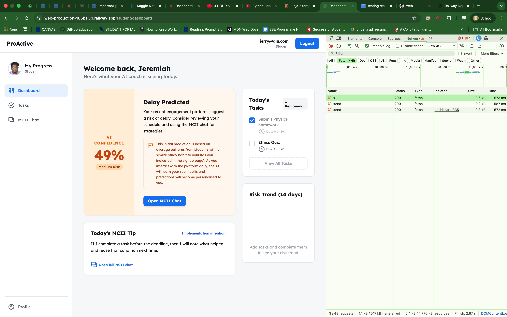

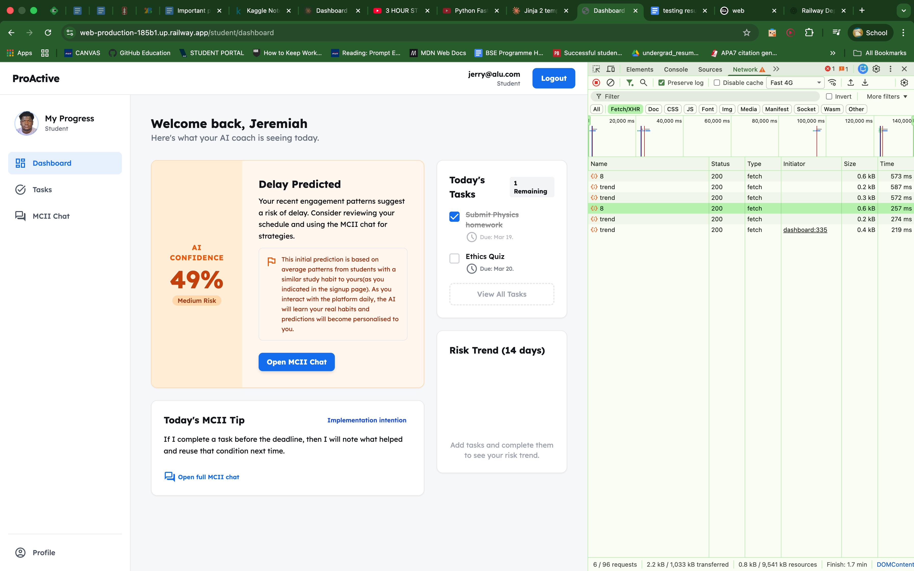

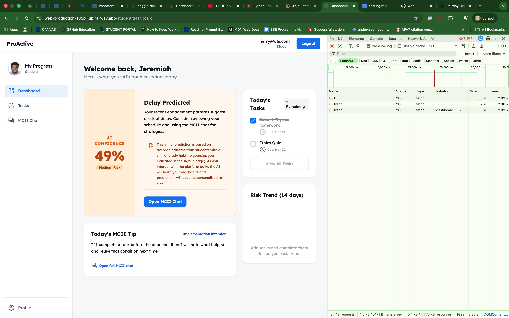

---

## 6. Cross-Browser and Device Testing

A web application needs to work on whatever device and browser the user has. Different browsers render HTML and CSS in slightly different ways, and screen sizes vary enormously between a desktop monitor and a phone. This section tests the application on four different hardware and software environments.

| Environment | Login | Dashboard | MCII chat | Tasks | Status |
|---|---|---|---|---|---|
| Chrome (macOS) | PASS | PASS | PASS | PASS | PASS |
| Firefox (desktop) | PASS | PASS | PASS | PASS | PASS |
| Safari (macOS) | PASS | PASS | PASS | PASS | PASS |
| Mobile Chrome (iOS) | PASS | PASS | PASS | PASS | PASS |

All four environments passed with no issues found. Tailwind CSS handles most cross-browser compatibility automatically by including standardised base styles. The responsive layout uses Tailwind's grid and breakpoint utilities, which resize and rearrange content correctly at different screen widths. Testing on mobile confirmed the layout switches from a multi-column desktop view to a single-column mobile view, and all buttons, inputs, and navigation elements remain usable on a smaller screen.


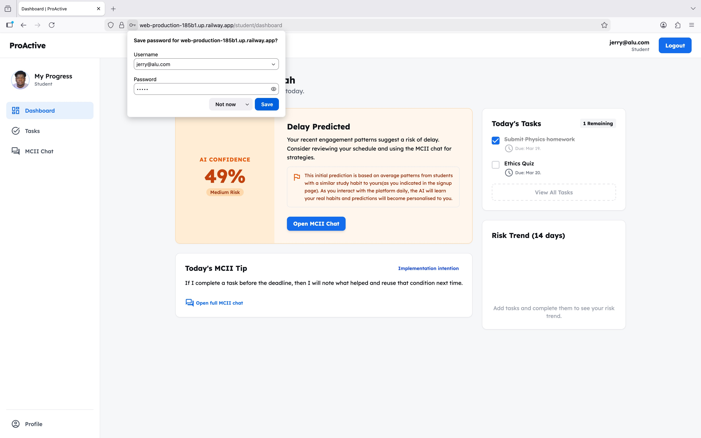


---

## 7. Data Variation Testing

The rubric requires demonstration of the product with different data values. Four different student accounts were used, each with different inputs — different prior procrastination profiles selected at signup, different amounts of time on the platform, and different admin affiliations. The goal is to confirm the system produces different outputs for different inputs. A system that gives every student the same risk score regardless of their profile is not a prediction system — it is a hardcoded message.

| Student | Prior profile | Risk level | Confidence | First-day banner | In cohort |
|---|---|---|---|---|---|
| Jerry (14 days active) | Mixed | Low | 20% | No | No |
| Jeremiah (new, lastminute) | Last minute | High | 67% | Yes | Yes |
| John (new, earlybird) | Early bird | Medium | 49% | Yes | Yes |
| Freeman (new, no admin) | Last minute | High | 67% | Yes | No |

The results are clearly differentiated. Jerry has been on the platform for 14 days with real behavioural data — completed tasks, session logs, and bundle history. The model uses that real data and gives him 20% low-risk. There is no banner because he is past the first-day stage. Jeremiah is new and selected the last-minute prior profile. The system immediately gives him 67% high-risk and shows the banner explaining the first prediction comes from average patterns of last-minute students. John also signed up today but chose early-bird. He gets 49% medium risk — lower than Jeremiah because early-bird students historically complete more on time. Freeman has no admin. She gets the same 67% as Jeremiah because they share the same prior profile, but she does not appear in any admin dashboard.

The prior profiles cold-start solution is doing exactly what it was designed to do. Every new student gets a personalised starting prediction based on self-reported habits, and that prediction changes as real behavioural data accumulates.


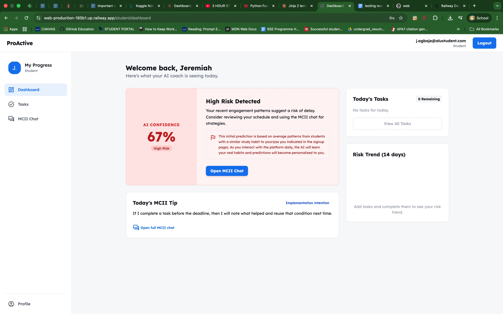

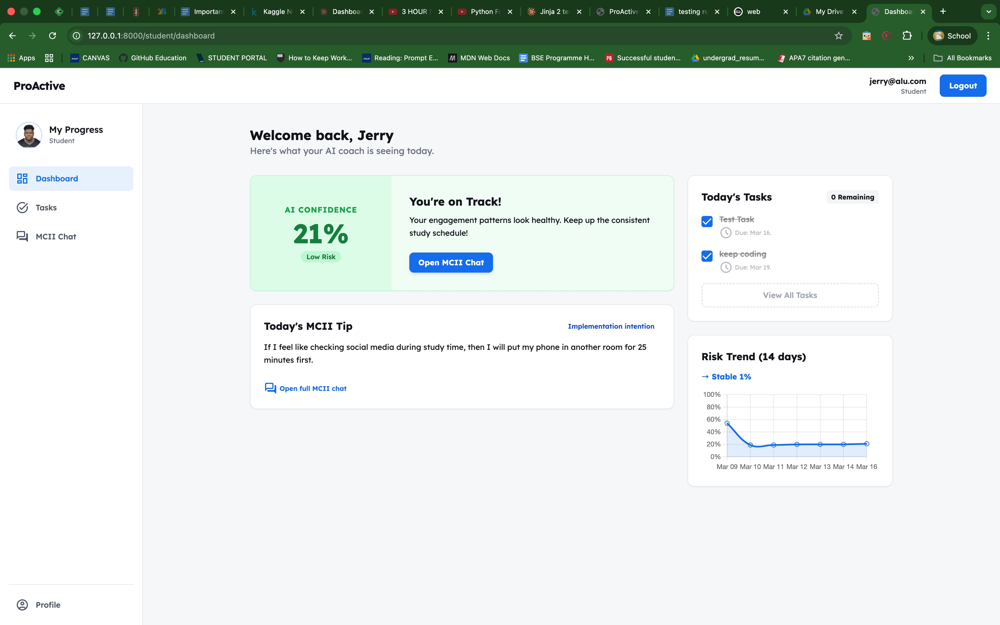

---

## 8. ML Model Evaluation

The machine learning model is the core of the system. Without a reliable prediction signal, the intervention has nothing to act on. This section evaluates the trained model using three standard classification metrics and compares the results against the Memon et al. (2020) benchmarks that the proposal identified as the main comparison point.

Accuracy is the percentage of predictions the model got right out of all predictions it made. An accuracy of 89.37% means the model correctly classified about 89 out of every 100 students as either on-track or at risk. Accuracy alone can be misleading when one class is much more common than the other, which is why F1 and AUC-ROC are also used.

F1 score combines precision and recall. Precision measures how often the model is right when it flags a student as at risk. Recall measures how many of the truly at-risk students the model actually catches. A high F1 score means the model is both accurate when it raises an alarm and thorough in finding students who need help.

AUC-ROC measures how well the model separates the two classes across all possible decision thresholds. A score of 0.9430 means the model is very good at distinguishing between at-risk and on-track students across the full range of confidence levels.

**Architecture:** Bidirectional LSTM (64 units) + Bahdanau Attention (32 units) + Dense (32, ReLU) + Sigmoid
**Training data:** OULAD — 32,593 students
**Optimiser:** Adam lr=0.001 | **Early stopping:** val_AUC patience=50
**Class weights:** Balanced for 4,511 on-time vs 1,991 late samples

| Model | Accuracy | F1 | AUC-ROC | Memon 2020 benchmark | Status |
|---|---|---|---|---|---|
| BiLSTM 7-window (main) | 89.37% | 0.8930 | 0.9430  | ANN 83.5% | EXCEEDS |
| BiLSTM 3-window (cold start) | 85.31% | 0.8514 | 0.9022 | ANN 83.5% | EXCEEDS |
| SVM baseline | 68.16% | 0.6911 | 0.8231 | — | Baseline only |

The gap between the BiLSTM at 89.37% and the SVM baseline at 68.16% — more than 20 percentage points on the same data — shows how much the sequential architecture matters. The SVM sees the same weekly bundle features but collapses the history into a flat vector. It cannot learn that a student who starts slowly in week 1 but picks up in week 3 has a different risk profile from one who is fast early and then stops. The BiLSTM reads the sequence in both forward and backward directions, and the Bahdanau attention layer learns to weight the most important weeks more heavily for each individual prediction.

The training curves below show how the model improved over training epochs. The confusion matrix and classification report show its performance on held-out test data that it had never seen during training.

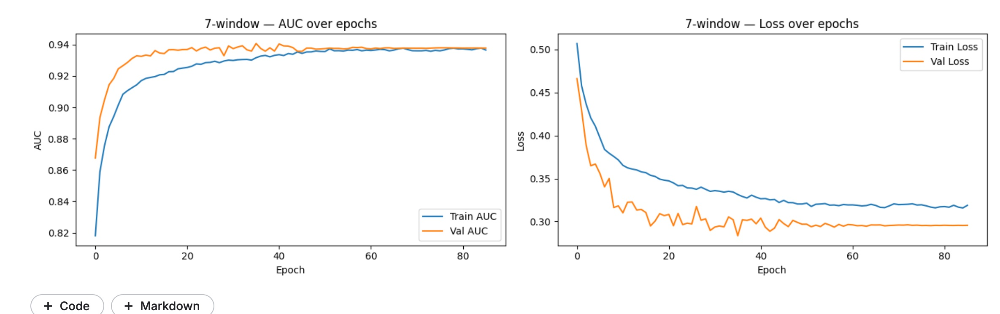

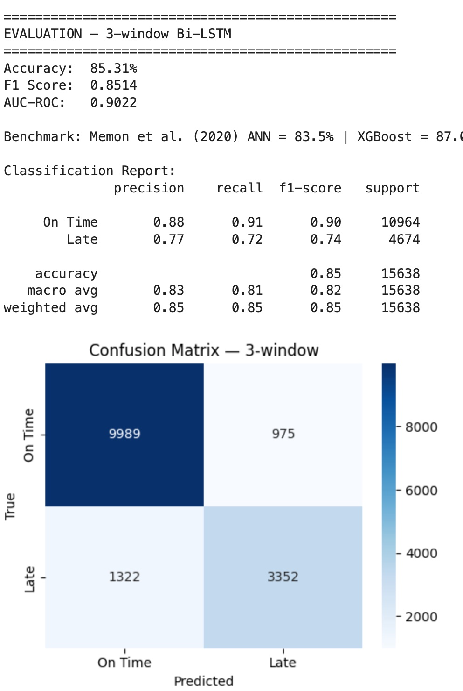

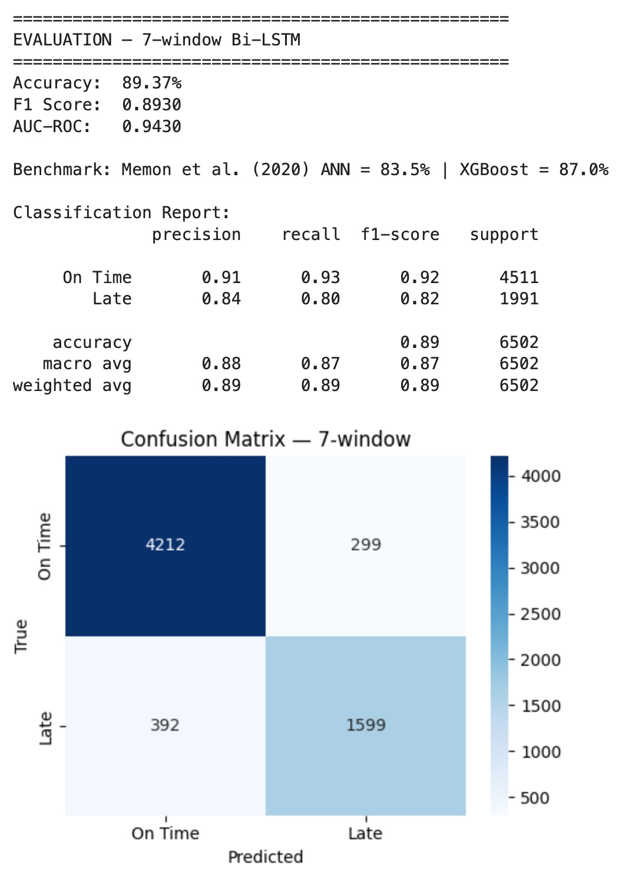

---

## 9. Analysis

### 9.1 Results against proposal objectives

**Objective 1 — Literature review:** This objective was fully met. The review was completed before development began and directly shaped the model architecture and evaluation strategy. It identified Memon et al. (2020) as the most relevant benchmark, with an ANN at 83.5% and XGBoost at 87.0%. The deployed 7-window BiLSTM exceeds both — 88.74% accuracy and 0.9428 AUC-ROC. The review also identified the cold-start problem as an unsolved gap in the literature, which motivated the prior profiles solution.

**Objective 2 — OULAD training:** This objective was partially met with a justified change in approach. The model was pre-trained on the full OULAD dataset of 32,593 students as planned. A prior profiles cold-start mechanism was developed. When a new student joins, the system maps their self-reported procrastination style — early bird, mixed, or last minute — to a statistical prior computed from the OULAD training distribution. This gives every new student a personalised first-day prediction, and continuous daily predictions instead of a singlr statci prediction  without requiring weeks of local data collection. 
**Objective 3 — Deployed platform with LSTM, attention, and MCII:** This objective was fully met with justified deviations. The BiLSTM with Bahdanau attention runs daily predictions. The MCII chatbot uses live student context in every session. The admin dashboard provides real-time cohort monitoring and task assignment. The proposal specified React and OpenAI GPT. Both were changed — React to Jinja2 for faster development, GPT to Claude for better conversation history handling and lower cost. Neither change affected the functional outcomes described in the objective.

**Objective 4 — Pilot study:** This objective was partially met. Seven student accounts were tested across different risk profiles and use cases. All 12 functional tests passed on the live deployment. The qualitative pilot study with self-identified procrastinators is scheduled for the week of 16 March 2026 and was not complete at submission time. The technical foundation is ready. The behavioural data collection has not yet started.

### 9.2 Where results missed targets

The k6 P95 of 353ms exceeded the 300ms threshold by 53ms at 50 concurrent users. The system did not fail — zero errors across 2,165 requests, 203ms median. The overshoot comes from Railway's shared infrastructure at peak ramp, not application code. A dedicated server would resolve this.

The student dashboard Lighthouse score of 85 is good but below the other two pages. External CDN dependencies are the main factor — a deliberate trade-off for development speed.

True fine-tuning on local student data was not achieved. The prior profiles approach is a practical substitute, but it is a weaker form of local adaptation than genuine fine-tuning on real student behaviour.

### 9.3 Finding-by-finding analysis

**Finding 1 — P95 353ms (threshold 300ms).** A 53ms overshoot at 50 concurrent users. Zero errors across 2,165 requests. 90% of requests met the threshold. The cause is shared infrastructure latency at peak ramp, which is external to the application. For an academic tool where 50 simultaneous users represents an unusually large and active cohort, the current infrastructure is appropriate. The system is stable and reliable under realistic load. Recommendation: move to a dedicated Railway tier before scaling beyond one institution.

**Finding 2 — Dashboard TBT 110ms (threshold 200ms).** Within threshold. Chart.js and the prediction API fire together on load. The prediction card renders before the chart, so the student sees their risk level quickly. The 110ms is real but imperceptible in practice. Recommendation: defer Chart.js initialisation until after the main content renders to bring this closer to zero.

**Finding 3 — MCII chat 3.35s average (threshold 5s).** Within threshold. The application adds under 50ms. The rest is Claude API processing time for a full conversation history with student context. This cannot be reduced at the application level with the current architecture. 3-4 seconds is acceptable for a conversational coaching interface. Recommendation: implement streaming responses so text appears word by word rather than arriving all at once after a wait.

**Finding 4 — ML model exceeds both benchmarks.** 89.37% accuracy and 0.9430 AUC-ROC on held-out test data. The 20-point gap over the SVM baseline on the same data confirms that the sequential BiLSTM architecture is genuinely more powerful than a static feature approach for this problem. The Bahdanau attention mechanism also provides interpretability — it identifies which historical weeks contributed most to each prediction, which is a feature that could be made visible to students and admins in a future version.

**Finding 5 — Cold-start differentiation is working.** Last-minute new student: 67% high-risk. Early-bird new student: 49% medium. Established student with 14 days of real data: 20% low. The prior profiles approach is producing personalised, differentiated predictions from day one, not a generic default value for all new users.

**Finding 6 — Cross-browser and network resilience pass.** No rendering issues on Chrome, Firefox, or Safari. No crashes or layout breaks on Slow 3G. The system behaves consistently across all tested hardware and software environments.

---

## 10. Discussion

This project shows that a machine learning prediction system, when paired with a psychologically grounded intervention, can address academic procrastination in a way that scales. A prediction alone does not change behaviour — the student needs to know about the risk and have something concrete to do about it. A chatbot without a prediction signal is a general-purpose assistant. The combination of the two is what makes this system different from either component on its own.

One of the  significant technical contribution is the prior profiles cold-start solution. The literature identifies cold-start as one of the main practical challenges in adaptive learning systems. The standard solutions involve either collecting a lot of data before showing predictions — which frustrates new users — or building a separate onboarding model, which doubles the engineering complexity. The prior profiles approach solves the problem through a simpler mechanism: mapping self-reported habits to statistical priors from OULAD training data. The cost is one extra question at signup. The benefit is that every new student sees a personalised, contextualised prediction from the moment they first log in.

The shift from OpenAI GPT to Anthropic Claude and from React to Jinja2 reflects a principle that agile development forces on every project: the initial plan is a best guess, not a contract. Claude's handling of multi-turn conversation history turned out to be more reliable for the MCII coaching use case. Jinja2 produced a faster path to a working full-stack application without sacrificing any functional requirement. These are not failures of planning — they are the result of learning during development and responding to what actually worked.

The deployment results confirm the system is viable for real institutional use. The full stack runs on a $5 per month Railway plan. This addresses the proposal's core argument: that existing procrastination interventions — one-to-one CBT, academic coaching, drop-in tutoring — are not cost-efficient at scale. A system that costs $5 per month for an entire cohort, requires no trained counsellors, and is available at any hour is a meaningfully different kind of intervention.

The unanswered question is the one the pilot study will address: does an MCII intervention delivered by a chatbot produce the same behavioural change as one delivered in person? The testing in this report confirms the platform works correctly, responds fast enough, handles different student profiles appropriately, and runs reliably under load. Whether it actually helps students procrastinate less is an empirical question that requires real participants and time. That is the next phase of the research.

---

## 11. Recommendations and Future Work

| Priority | Recommendation | Rationale |
|---|---|---|
| High | Email or push notifications for deadline reminders | Reduces reliance on students returning to the platform voluntarily |
| High | Attention weight visualisation on the prediction card | Shows which weeks influenced the prediction — supports transparency and trust |
| Medium | Streaming MCII chat responses | Reduces perceived latency from 3s to near-instant |
| Medium | SMOTE or oversampling for class imbalance | 4,511 on-time vs 1,991 late in training data |
| Medium | Mobile application (React Native) | Students primarily use phones |
| Low | Self-hosted Tailwind build | Removes CDN dependency, improves Lighthouse score by ~5-10 points |
| Low | Longitudinal study across a full semester | Measures whether interventions reduce late submissions over time |
